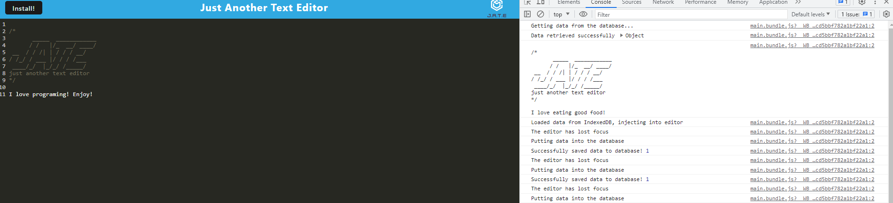

# **Text Editor Web Application** 

A text editor web application that allows you to create and edit text content, backed by IndexedDB for seamless offline use.

# **Table of Contents**
<ul>
<li><a href="#features">Features</a></li>
<li><a href="#installation">Installation</a></li>
<li><a href="#usage">Usage</a></li>
<li><a href="#live-link">Live Link</a></li>
<li><a href="#technology">Technology</a></li>
<li><a href="#deployment-on-heroku">Deployment on Heroku</a></li>
<li><a href="#credits">Credits</a></li>
<li><a href="#contribute">Contribute</a></li>
<li><a href="#questions">Questions</a></li>
<li><a href="#license">License</a></li>
</ul>

# **Features**

- Create and edit text content.
- IndexedDB storage for automatic content saving and retrieval.
- Service Worker integration for offline use.
- Webpack bundling for efficient JavaScript management.
- Manifest file for progressive web app capabilities.
- Support for next-gen JavaScript features.

# **Installation**

1. Clone the repository to your local machine:

- git clone git@github.com:Essence1987/texteditor.git

2. Navigate to the project directory:

- cd texteditor

3. Install the required dependencies:

- npm install

4. Start the application:

- npm run start

# **Usage**

1. Open the text editor web application in your preferred browser.

2. Create or edit text content as needed.

3. Your content is automatically saved to IndexedDB when you click off the DOM window.

4. Close and reopen the text editor to see your saved content retrieved from IndexedDB.

5. Click the "Install" button to download the web application as an icon on your desktop.

# **Live Link**

You can access the live version of this project [here](https://pure-bastion-18557-4ff18284fffa.herokuapp.com/).

# **Technology**

- HTML
- CSS
- JavaScript
- IndexedDB
- Service Worker (Workbox)
- Webpack
- Babel

# **Deployment on Heroku**

To deploy this web application on Heroku, you can follow these steps:

1. Make sure you have the [Heroku CLI](https://devcenter.heroku.com/articles/heroku-cli) installed on your local machine.

2. Log in to your Heroku account using the CLI:

- heroku login

3. Navigate to your project directory:

- cd [project-directory]

4. Initialize a Git repository (if not already initialized):

- git init

5. Create a new Heroku app:

- heroku create

6. Commit your changes to Git:

- git add -A
- git commit -m "Deploying to Heroku"

7. Push your code to Heroku:

- git push heroku main

8. Access your deployed web application by opening it in your browser:

- heroku open

Your text editor web application should now be live on Heroku, and you can share the URL with others.

# **Credits**

This was a solo project with no contributors taking part.

# **Contribute**

This is a personal project, and I am not currently accepting Contributions. However, if you wish to reach me for further projects, please message me at hwmelander@gmail.com.

# **Questions**

Click the image below to go to my GitHub page!

My email is hwmelander@gmail.com

# **License**

This project is licensed under the [MIT License](https://opensource.org/licenses/MIT).
